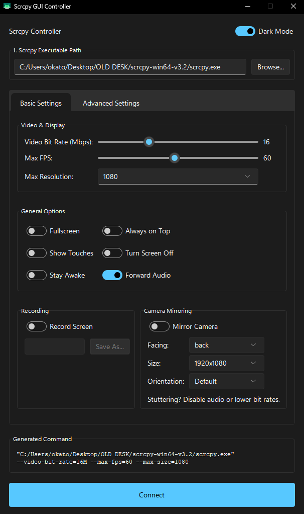

# Scrcpy GUI Controller

A modern, user-friendly desktop application to visually control the powerful [scrcpy](https://github.com/Genymobile/scrcpy) command-line tool. This GUI provides a simple way to configure and launch `scrcpy` with all your favorite settings, without needing to memorize command-line arguments.

<p align="center">
  
</p>

## ✨ Features

- **Modern & Clean UI:** A professionally designed interface that is easy to navigate.
- **Light & Dark Modes:** Toggle between light and dark themes to suit your preference.
- **Comprehensive Options:** Access both basic and advanced `scrcpy` settings through an organized tabbed interface.
- **Camera Mirroring:** Easily switch between screen and camera mirroring with dedicated options for camera source, size, and orientation.
- **Recording:** Choose where to save your screen recordings with a simple file dialog.
- **Persistent Settings:** Your configuration is automatically saved when you close the app and reloaded on the next launch.
- **Cross-Platform:** Built with Python and Tkinter, it works on Windows, macOS, and Linux.

## 📥 Download

You can download the latest release of the application from the [**Releases Page**](https://github.com/YOUR_USERNAME/YOUR_REPOSITORY/releases).

For users who prefer to run from source, please follow the installation instructions below.

## 🚀 Installation

To use the Scrcpy GUI Controller from source, you need to have Python and `scrcpy` installed on your system.

### 1. Install Python

If you don't already have Python, download it from the official website.

- **Website:** [python.org/downloads](https://www.python.org/downloads/)
- **Important:** During installation on Windows, make sure to check the box that says **"Add Python to PATH"**.

### 2. Install `scrcpy`

Download the latest release of `scrcpy` for your operating system.

- **Website:** [github.com/Genymobile/scrcpy/releases](https://github.com/Genymobile/scrcpy/releases)
- **Instructions:** Unzip the downloaded file to a permanent location on your computer (e.g., `C:\scrcpy` on Windows).

### 3. Install App Dependencies

This application uses a modern theme library that needs to be installed via `pip`, Python's package installer.

Open your terminal or command prompt and run the following command:
```bash
pip install sv-ttk
```

## 🖥️ How to Use

1.  **Download the Application:**
    - Download the `scrcpy_app.py` file from this repository.

2.  **Run the Application:**
    - Open a terminal or command prompt.
    - Navigate to the directory where you saved `scrcpy_app.py`.
    - Run the script with the following command:
      ```bash
      python scrcpy_app.py
      ```

3.  **Configure the Path:**
    - The first time you run the app, you'll need to tell it where `scrcpy` is located.
    - Click the **"Browse..."** button.
    - Navigate to the folder where you unzipped `scrcpy` and select the `scrcpy.exe` (on Windows) or `scrcpy` (on macOS/Linux) file.
    - This path will be saved automatically for future sessions.

4.  **Adjust Settings:**
    - Use the tabs and controls to configure your desired mirroring session.

5.  **Connect:**
    - Click the **"Connect"** button to launch `scrcpy` with your selected options.

## ⚙️ Settings Management

- **Automatic Saving:** All your settings, including the `scrcpy` path and UI preferences, are automatically saved to a configuration file (`.scrcpy_gui_settings.json`) in your user home directory when you close the application.
- **Automatic Loading:** The next time you start the app, your last-used settings will be loaded automatically.

## 🤝 Contributing

Contributions, issues, and feature requests are welcome! Feel free to check the [issues page](https://github.com/YOUR_USERNAME/YOUR_REPOSITORY/issues).

## 📄 License

This project is licensed under the MIT License - see the [LICENSE.md](LICENSE.md) file for details.
